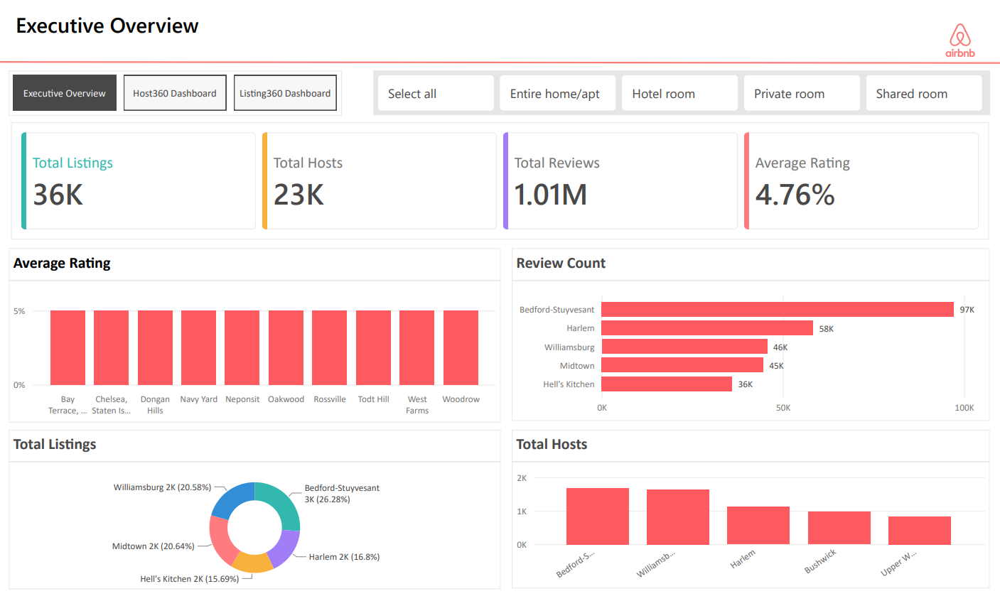
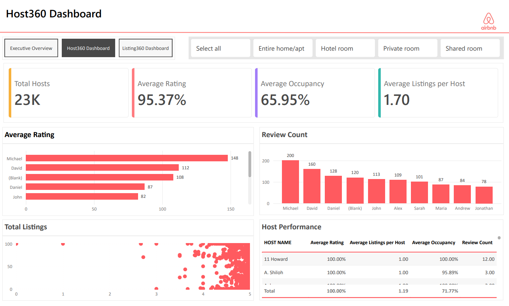
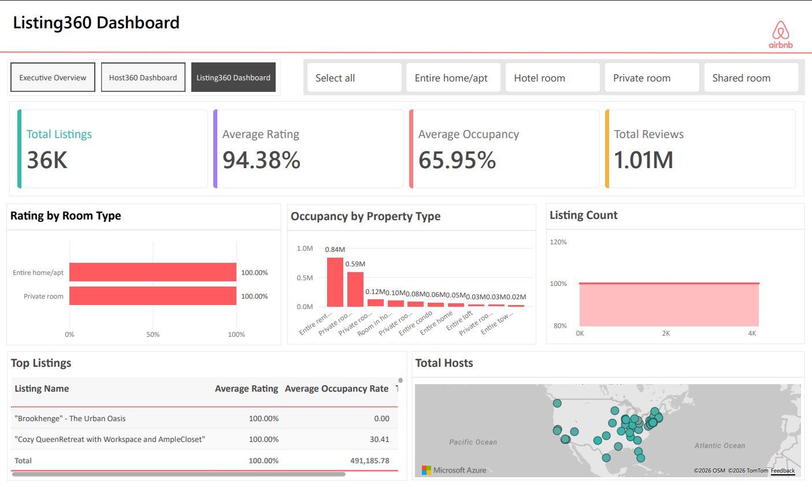

# Modern Analytics Engineering with Snowflake & dbt

An end-to-end analytics engineering project that transforms raw Airbnb data into business-ready data products using the **Modern Data Stack**. This project demonstrates how analytics engineers build scalable data platforms using **AWS S3, Snowflake, dbt, dimensional modeling, and Power BI**.

Instead of focusing only on dashboards, this project follows modern analytics engineering principles by creating reusable business data products that answer real business questions.

---

## Project Overview

Business users don't think in tables.

They ask questions like:

- Which hosts are our highest performers?
- Which listings receive the best reviews?
- Which neighborhoods are performing well?
- Which hosts may require operational support?

Rather than allowing every analyst to write different SQL queries, this project builds trusted business data products that provide consistent answers across the organization.

---

## Architecture

```text
                Airbnb Dataset
                      │
                      ▼
                  Amazon S3
                      │
                      ▼
                 Snowflake RAW
                      │
                      ▼
                dbt Staging Layer
                      │
                      ▼
            dbt Intermediate Models
                      │
                      ▼
          Dimensions & Business Metrics
                      │
                      ▼
        Host360      Listing360
                │        │
                └────────┘
                      │
                      ▼
        Executive Mart (Neighborhood Summary)
                      │
                      ▼
               Power BI Dashboards
```

---

## ⚙️ Technology Stack

| Layer | Technology |
|--------|------------|
| Cloud Storage | AWS S3 |
| Data Warehouse | Snowflake |
| Transformation | dbt |
| Data Modeling | Kimball Dimensional Modeling |
| Business Intelligence | Power BI |
| Version Control | Git & GitHub |
| Language | SQL |

---

## 📂 Project Structure

```text
airbnb-modern-data-stack/

├── models/
│   ├── staging/
│   ├── intermediate/
│   ├── dimensions/
│   └── marts/
│
├── analyses/
├── macros/
├── snapshots/
├── tests/
├── powerbi/
├── docs/
└── README.md
```

---

## 📊 Data Products

### Host360

A business-ready view providing a complete picture of each Airbnb host.

Includes:

- Host information
- Portfolio metrics
- Review metrics
- Occupancy metrics
- Availability metrics

---

### Listing360

A unified view of every Airbnb listing.

Includes:

- Listing details
- Property information
- Review metrics
- Occupancy metrics
- Capacity metrics

---

### Executive Mart

Neighborhood Summary aggregates listing performance into executive-level KPIs for reporting and dashboards.

---

## Power BI Dashboards

The project includes three dashboards built on top of the business data products.

### Executive Dashboard

Provides a high-level overview of marketplace performance.

**Key Metrics**

- Total Listings
- Total Hosts
- Average Rating
- Total Reviews



---

### Host360 Dashboard

Designed for operations teams to monitor host performance.

**Questions Answered**

- Which hosts perform best?
- Which hosts own the most listings?
- Which hosts have the highest occupancy?
- Which hosts need attention?



---

### Listing360 Dashboard

Designed for product and marketplace teams.

**Questions Answered**

- Which listings perform best?
- Which neighborhoods have the highest ratings?
- Which property types receive the best reviews?
- Which listings have the highest occupancy?



---

## 📚 Blog Series

I documented the complete architecture, implementation, and lessons learned while building this project.

Topics include:

- Modern Analytics Engineering
- Snowflake Data Ingestion
- dbt Layered Modeling
- Kimball Dimensional Modeling
- Building Host360
- Building Listing360
- Executive Data Products
- Power BI Dashboards
- Lessons Learned

👉 **Read the full series here:**  https://www.avasbajracharya.com.np/blogs

---

## 💡 Key Learnings

Through this project I learned:

- Modern Analytics Engineering principles
- Layered data modeling with dbt
- Snowflake data ingestion from AWS S3
- Kimball dimensional modeling
- Building reusable business data products
- Designing executive analytics marts
- Developing business-focused Power BI dashboards

---

## 🚀 Future Improvements

- Incremental dbt models
- CI/CD for dbt deployments
- Data quality monitoring
- dbt Exposures
- Semantic Layer implementation
- Machine Learning models for host performance prediction

---

## 👨‍💻 Author

**Avas Bajracharya**

- 🌐 Website: https://www.avasbajracharya.com.np
- 💼 LinkedIn: https://www.linkedin.com/in/avasbajracharya/
- 📝 Blog: https://www.avasbajracharya.com.np/blogs

---

## ⭐ If you found this project helpful, consider giving it a star!